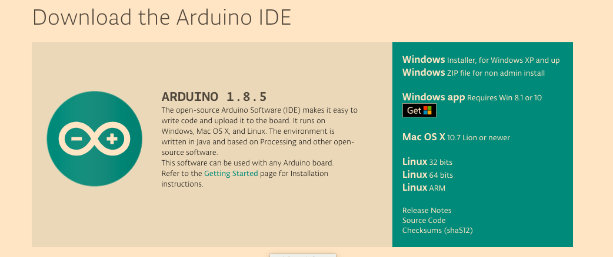
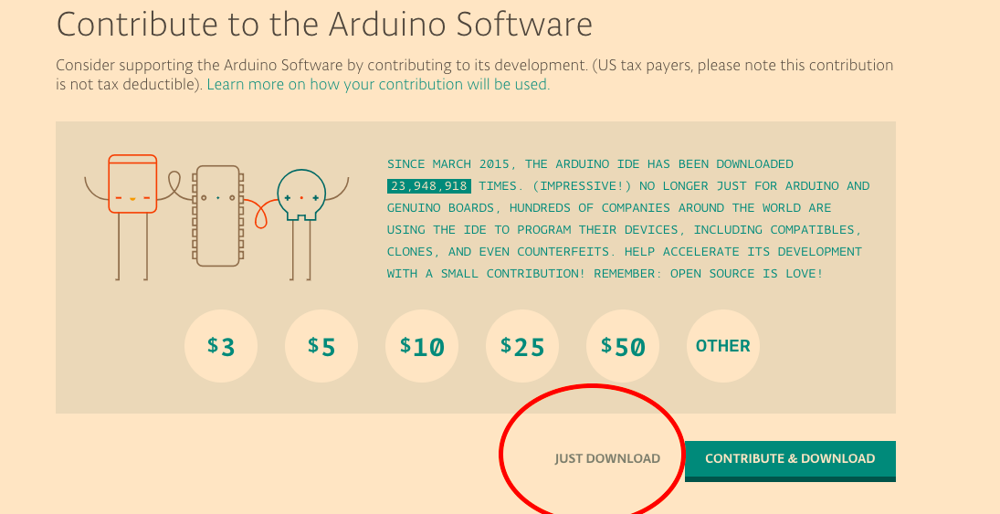
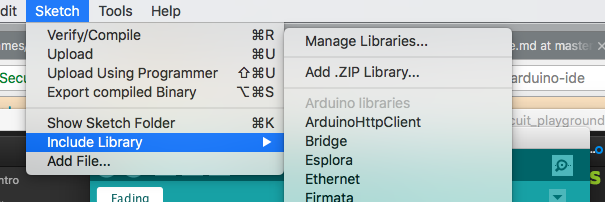
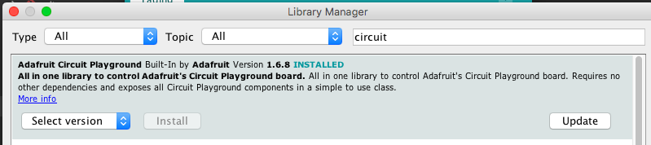
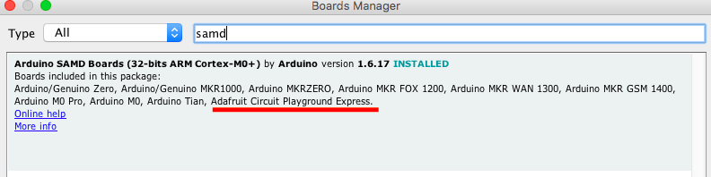
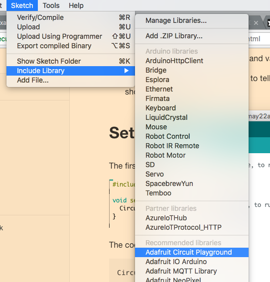

# Circuit Playground

The circuit playground is a great first board. You have a ton of inputs and outputs.

So, you have many options for what data you take in, and what data you give out. This means you can create any number of projects.

For this first project, we will program the LEDs to turn on and off, and then we will make the lights come on and off based off of data from a light sensor.

## Setting up your Dev Environment

A dev environment consists of the tools needed to program. We need a place to write our code, send our code to where it needs to be, and a way to tell what is wrong with our code so we can fix it.

If you want to setup a full dev environment, check out this other [tutorial](https://github.com/profShiba/pre_work/blob/master/readme.md) I made.

First, we will write our code in the Arduino IDE. IDE stands for integrated developers environment. The nice thing about this is that we can write, compile, send, and debug our code all in this program! However, we will still need to download a few libraries to get everything to work.

You want to go [here](https://www.arduino.cc/en/Main/Software) and then click whatever your OS is. This tutorial is for MAC.

Then find the free way to download, or share the love if you can!

Follow the install instructions by opening the folder once downloaded.

## Installing libraries

What language are we using with Arduino? The short answer is C/C++, the long answer is that we are using a set of predefined functions in C/C++. What does that mean?

Well, we have to download a few libraries to work with the circuit playground because they contain shortcuts that tell the board to do something, which is much easier and faster than starting from scratch.

The first library we want to get is one that we can program the board with, the next library will be one that tells the computer what a circuit playground is, because it has no idea!

### First library

Open the Arduino IDE and go to sketch > include library > manage library

Next, type in circuit playground and download the accompanying library

### Second libraries (Boards)

Now that we can program the circuit playground, we need the computer to be able to talk to the circuit playground and to understand what it is. For now, we will say that the computer speaks much quicker and with a different accent than the circuit playground. This board manager helps with that.

First go to tools > board > manager

Then type in SAMD and download

## RESET

Now you need to turn it on and off again! Meaning, just restart the Arduino IDE. You are almost ready to gooooo.

# Time to Code!
IMPORTANT
- Arduino reads asynchronously: from the top down.
- Compile before you upload code
- Always type code! Never copy and paste
- Questions are your friend

## Functions

We are going to create a basic program to turn the onboard LEDs off and on. We will do this by writing two functions, but first, what is a function?

- Basically, a list of commands

  A function's code is anything between the brackets { } If code is outside the brackets { } it is not a part of the function, and will most likely cause errors.
  Generally we define requirements and variables outside the brackets { }.
  For example, we will use #include to tell the program to include the circuit playground (cpx) library- all our shortcuts!

## Making a new Sketch
- Simply start the IDE up and go to file >> new.

####Next, we will configure our settings for the cpx by selecting the board

####The port

#### adding the library

