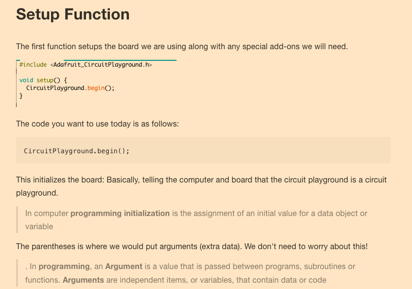

# Circuit Playground


The circuit playground is a great first board. You have a ton of inputs and outputs.

So, you have many options for what data you take in, and what data you give out. This means you can create any number of projects.

For this first project, we will program the LEDs to turn on and off, and then we will make the lights come on and off based off of data from a light sensor.


## Setting up your Dev Environment

A dev environment consists of the tools needed to program. We need a place to write our code, send our code to where it needs to be, and a way to tell what is wrong with our code so we can fix it.

If you want to setup a full dev environment, check out this other [tutorial](https://github.com/profShiba/pre_work/blob/master/readme.md) I made.

First, we will write our code in the Arduino IDE. IDE stands for integrated developers environment. The nice thing about this is that we can write, compile, send, and debug our code all in this program! However, we will still need to download a few libraries to get everything to work.

You want to go [here](https://www.arduino.cc/en/Main/Software) and then click whatever your OS is. This tutorial is for MAC.


Then find the free way to download, or share the love if you can!


Follow the install instructions by opening the folder once downloaded.

## Installing libraries

What language are we using with Arduino? The short answer is C/C++, the long answer is that we are using a set of predefined functions in C/C++. What does that mean?

Well, we have to download a few libraries to work with the circuit playground because they contain shortcuts that tell the board to do something, which is much easier and faster than starting from scratch.

The first library we want to get is one that we can program the board with, the next library will be one that tells the computer what a circuit playground is, because it has no idea!

### First library

Open the Arduino IDE and go to sketch > include library > manage library


Next, type in circuit playground and download the accompanying library


### Second libraries (Boards)

Now that we can program the circuit playground, we need the computer to be able to talk to the circuit playground and to understand what it is. For now, we will say that the computer speaks much quicker and with a different accent than the circuit playground. This board manager helps with that.

First go to tools > board > manager


Then type in SAMD and download


## RESET


Now you need to turn it on and off again! Meaning, just restart the Arduino IDE. You are almost ready to gooooo.

# Time to Code!
IMPORTANT
- Arduino reads asynchronously: from the top down.
- Compile before you upload code
- Always type code! Never copy and paste
- Questions are your friend

## Functions

We are going to create a basic program to turn the onboard LEDs off and on. We will do this by writing two functions, but first, what is a function?

- Basically, a list of commands

  A function's code is anything between the brackets { } If code is outside the brackets { } it is not a part of the function, and will most likely cause errors.
  Generally we define requirements and variables outside the brackets { }.
  For example, we will use #include to tell the program to include the circuit playground (cpx) library- all our shortcuts!

## Making a new Sketch
- Simply start the IDE up and go to file >> new.
- Plug the circuit playground into the computer

#### Next, we will configure our settings for the cpx by selecting the board


#### The port


#### adding the library


#### setup


#### loop

```c
#include <Adafruit_CircuitPlayground.h> // import cp library

void setup() {
  CircuitPlayground.begin(); // init cp
}

void loop() {
  CircuitPlayground.clearPixels();        // turn off all leds
  delay(1000);                            // wait 1 second

  // on the cp, set pixel num to rgb scale
                              //led 0 is red (or the first LED we count from 0 in programming)
  CircuitPlayground.setPixelColor(0, 255,0,0);
                            //led 1 is green
  CircuitPlayground.setPixelColor(1, 0, 255,0);
                          // led 2 is blue
  CircuitPlayground.setPixelColor(2,   0, 0,255);

  CircuitPlayground.setPixelColor(3,   0, 128, 128);
  CircuitPlayground.setPixelColor(4,   0,   0, 255);
  CircuitPlayground.setPixelColor(5, 255,   0,   0);
  CircuitPlayground.setPixelColor(6, 128, 128,   0);
  CircuitPlayground.setPixelColor(7,   0, 255,   0);
  CircuitPlayground.setPixelColor(8,   0, 128, 128);
  CircuitPlayground.setPixelColor(9,   0,   0, 255);
  delay(1000);
}
```

- CircuitPlayground defines where we are doing what
- setPixelColor tells us what led # and then gives a rgb scale.
- 255 is full bright & 0 is off
- delay is the amount of time in milli seconds to wait

## Compile and Upload
Simply click the arrow!

## Program Two
#### Here is the full code, next we will break it down

```c++
#include <Adafruit_CircuitPlayground.h>   // imports library
int light;                                // variable
#define COLOR 0x001FF                     // constant


void setup() {
  // put your setup code here, to run once:
  CircuitPlayground.begin();          // inits board
  Serial.begin(9600);                 // sets agreed talk rate

}

void loop() {
  light = CircuitPlayground.lightSensor();   // collect data from light sensor
                                            // save data in variable light
  if(light < 50){                          // if lux value is less than 50
                                          // do this loop


            // start at 0, stop at 9, increase by 1
    for (int pixel = 0; pixel < 10; pixel++){
        // pixel is each led, set each led to variable value COLOR
       CircuitPlayground.setPixelColor(pixel,COLOR);
       // wait a half second before going to next light
       delay(500);
    }
  }
      // if lux is greater than 50 but less that 101
  else if(light > 50 && light < 101){
    CircuitPlayground.setPixelColor(0, 0,0,255);
  }

  else{
    CircuitPlayground.setPixelColor(0, 0, 255, 0);
    }
}
```

#### Imports, Variables, and Constants
- First, we included our library
- next we make a variable called light: a variable is a box that holds something for us. It is named so because it can and often does change
- lastly we define COLOR as a hex value. This is a constant, meaning it won't ever change.

```c
#include <Adafruit_CircuitPlayground.h>
int light;
#define COLOR 0x001FF
```

#### Setup
We simply say what board we are using and agree how fast the computer and circuit playground will speak (aka baud rate)

```c
void setup() {
  // put your setup code here, to run once:
  CircuitPlayground.begin();
  Serial.begin(9600); //baud rate

}
```
#### Function Loop
- first, we call in data from the light sensor and save it as a variable- since that data will be changing

```c
  void loop() {
    light = CircuitPlayground.lightSensor();
    ...
  }
```

#### Conditional
- next, we say if the light is less than 50 lux (The range is approximately 0 Lux to 1500 Lux maximum.) then do this loop

```c
  if(light < 50){ ...
}
```
#### loop
 We are saying for every pixel set the color to our constant color.
 - pixel count starts at 0
 - pixel < 10; stop after the 10th pixel (which is the 9th index). We count from 0
 - pixel++ go over every pixel one at a time

```c
    for (int pixel = 0; pixel < 10; pixel++){
       CircuitPlayground.setPixelColor(pixel,COLOR);
       delay(500);
    }
  }
```

#### Conditional ELSE IF
If it isn't 50 lux or darker, do this:

```c
  else if(light > 50 && light < 101){
    CircuitPlayground.setPixelColor(0, 0,0,255);
  }

  else{
    CircuitPlayground.setPixelColor(0, 0, 255, 0);
    }
}
```

## Loops

```c
#include <Adafruit_CircuitPlayground.h>

void setup() {
  CircuitPlayground.begin();
}

void loop() {
  //CircuitPlayground.clearPixels();
  // backwards loop
  for (int pixel = 10; pixel > -1; pixel--){
    CircuitPlayground.setPixelColor(pixel,0,0,255);
    delay(500);
  }
  // forward loop
  for( int pixel = 0; pixel < 10; pixel++){
    CircuitPlayground.setPixelColor(pixel,0,255,0);
    delay(500);
  }
}
```


## Pinout


