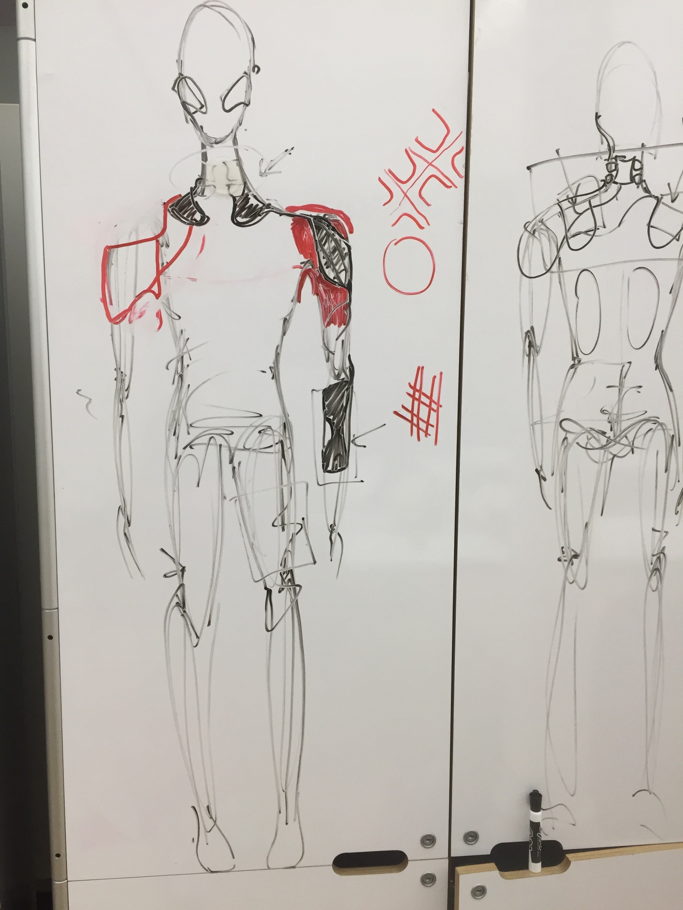
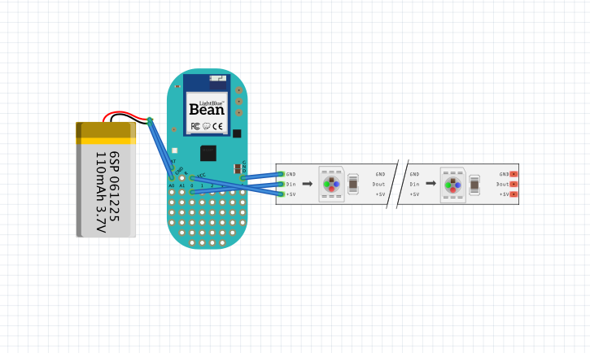
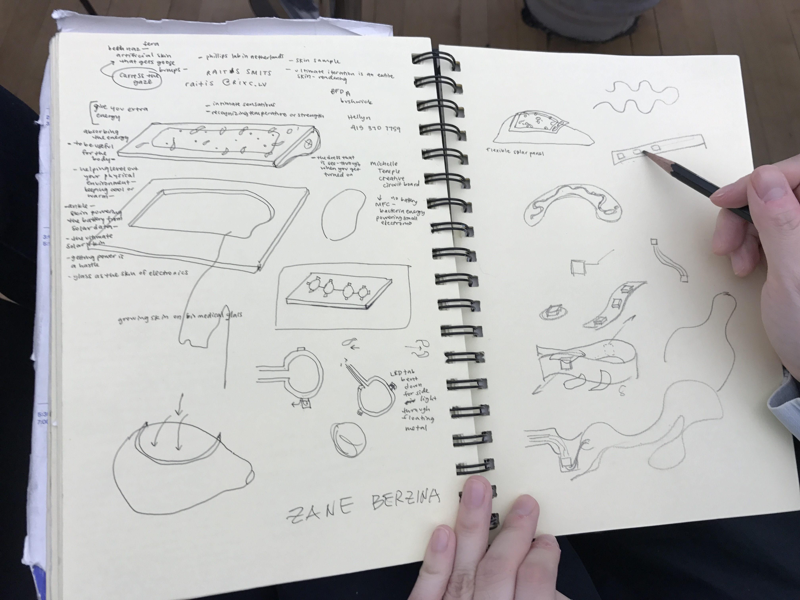
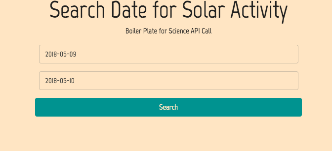
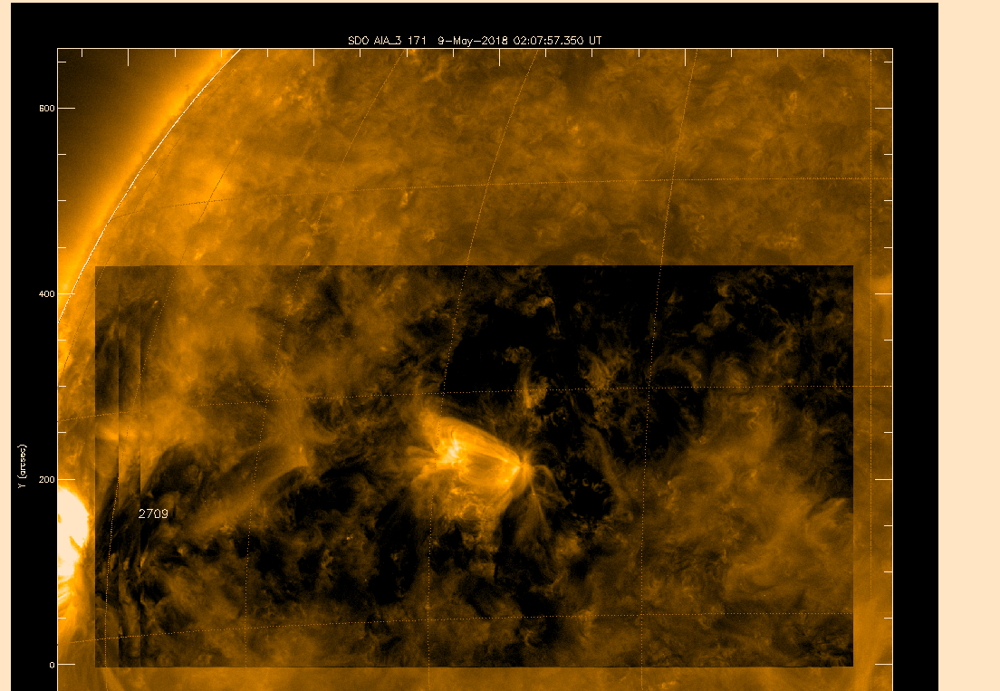
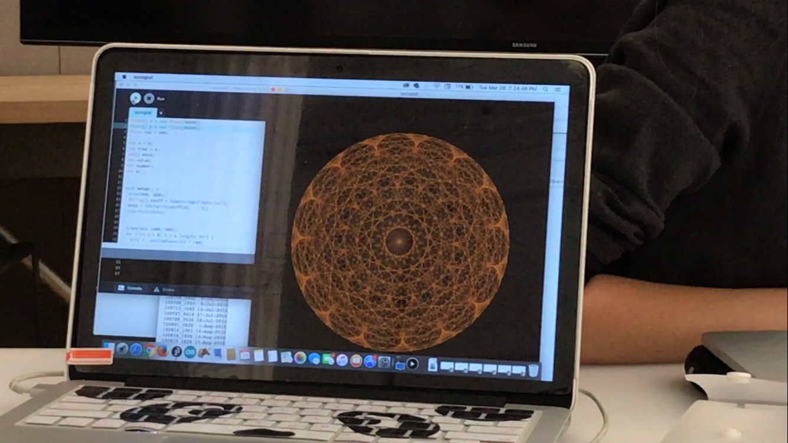
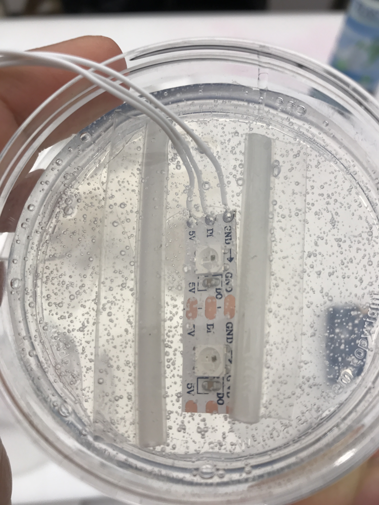
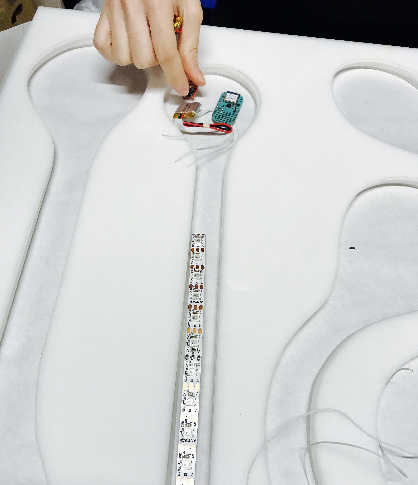
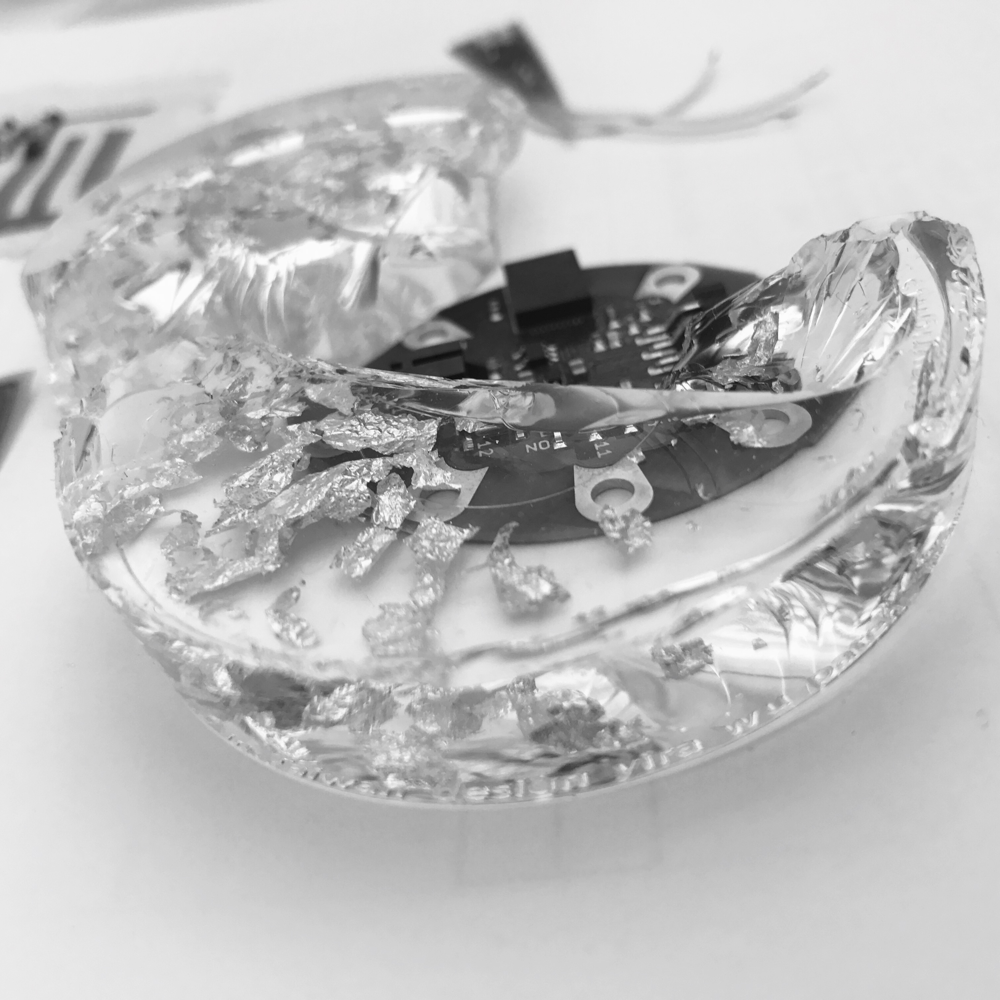

# Art & Tech


## p5 links

- [Shapes](https://www.youtube.com/watch?v=D1ELEeIs0j8&t=199s)
- [color](https://www.youtube.com/watch?v=9mucjcrhFcM)
- [User input](https://www.youtube.com/watch?v=RnS0YNuLfQQ)
- [Objects](https://www.youtube.com/watch?v=-e5h4IGKZRY)

# Code Along with P5
- [repo](https://github.com/kyle1james/solar_form/tree/master/bolier_plate)
- [ide](https://atom.io/)


# Circuit Playground 
## Light the Way
### The goal is to make a light show!


```c
// gives us all the short cuts
#include <Adafruit_CircuitPlayground.h>

void setup() {
// tells the computer that a circuit playground is connected
  CircuitPlayground.begin();
}

void loop() {
//                                 light,red,green,blue
    CircuitPlayground.setPixelColor(pixel,255,255,255);
//                                  0 is off 255 is all the way on

}

```

# Now you try!


# Loops

```c
      // for every neopixel
  for (int pixel = 0; pixel < 11; pixel+=2){
      // make it this color
    CircuitPlayground.setPixelColor(pixel,0,255,0);
    delay(100);
  }

```

# Light Sensor & Speaker with Circuit Playground 
- [understanding mapping](https://www.arduino.cc/reference/en/language/functions/math/map/)

```c

#include <Adafruit_CircuitPlayground.h>

int maxValue = 100;

void setup() {
  CircuitPlayground.begin();
}

void loop() {
  // use the light sensor and save data into a variable
  int sensorReading = CircuitPlayground.lightSensor();
  
  // map light data into something that makes sense for sound
  int frequency = map(sensorReading, 0, maxValue, 500, 800);

  Serial.println(sensorReading);

  //CircuitPlayground.playTone(frequency, duration_ms)
  CircuitPlayground.playTone(frequency, 50);
}

```


# Other How To's for Circuit Playground

### Complie & Upload your Code


### Then


### Now we verify the code, which will output any errors in the terminal. The check mark
Then upload. The arrow


### Even More Examples
[examples](https://github.com/kyle1james/examples)

### reverse loop
```c
  for (int pixel = 10; pixel > -1; pixel-=2){
    CircuitPlayground.setPixelColor(pixel,0,0,255);
    delay(50);
  }

```


#### The unconventional mixing and matching of subject areas

[itp](https://tisch.nyu.edu/itp)
[media lab](https://www.media.mit.edu/)
[eyebeam](https://www.eyebeam.org/)


# All About Data

## Analog & Digital
[resource](https://learn.sparkfun.com/tutorials/analog-vs-digital)

What? It's like two different languages in the electronic world and the languages are called signals?

Signals are passed between devices in order to send and receive information

### analog

Analog Signals are time-varying quantities: Basically, voltage changing over time to relay information.

Problem: Interference, these little guys can easily be interfered with. Examples are static on the radio or old school tv sets.


```
void loop() {
  // read the analog in value:
  sensorValue = analogRead(analogInPin);
  // map it to the range of the analog out:
  outputValue = map(sensorValue, 0, 1023, 0, 255);
  // change the analog out value:
  analogWrite(analogOutPin, outputValue);
```

### digital
There at 10 types of people in the world. Those who get binary and those who don'- [ ]

Digital signals try to solve the problem of analog interference by having two signal states: on or off. It's binary.


```
void loop() {
  digitalWrite(LED_BUILTIN, HIGH);   // turn the LED on (HIGH is the voltage level)
  delay(1000);                       // wait for a second
  digitalWrite(LED_BUILTIN, LOW);    // turn the LED off by making the voltage LOW
  delay(1000);                       // wait for a second
}
```

## Long Story Short
There are ways around both digital and analog to do what you want! Digital tends to be easier but cost more, and analog is the opposite


## Example of LED Art + Tech

### Planning Stage

A ton of work goes into planning. It is the most important stage as it serves as the how-to when building!


This includes tech planning as well. Both Art + Tech need to merge.



The Art folk were priceless in this Stage


### We got data from the Sun

So, we built a little app that collects live solar data


Then, we used the info from the sun to control LEDs in silicon skin with hand blown glass shards


This is where art and tech meet!


### Building

This was the first of several prototypes. You can check out the program prototype [here](https://art-tech-example.herokuapp.com/)





### Testing
You have to test and refine. Failing is just a step towards the end goal!



https://www.youtube.com/embed/-cnLp1fHb-Y
